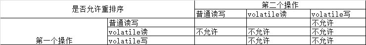

# volatile
~~~
volatile是java虚拟机提供的轻量级的同步机制

三个特性：
    1.保证可见性(主内存修改，每个线程都可见)
        当一个变量被声明为volatile时，它会告诉编译器和CPU将该变量存储在主内存中，而不是线程的本地内存中。即每个线程读取的都是主内存中最新的值，
        避免了多线程并发下的数据不一致问题。
    2.不保证原子性
    3.有序性（禁止指令重排）
        重排序可以分为编译器重排序和处理器重排序，volatile保证有序性，就是通过分别限制这两种类型的重排序。
 
 
 为了实现volatile的内存语义，编译器在生成字节码时，会在指令序列中插入内存屏障来禁止特定类型的处理器重排序。
 1.在每个volatile写操作前面插入一个StoreStore屏障
 2.在每个volatile写操作后面插入一个StoreLoad屏障
 3.在每个volatile读操作后面插入一个LoadLoad屏障
 4.在每个volatile读操作后面插入一个LoadStore屏障

可见性和有序性 是通过内存屏障来实现的, 参考文档：https://blog.csdn.net/huyongl1989/article/details/90712393
~~~

## JMM（java内存模型）
~~~
JMM(java内存模型Java Memory Model，简称JMM)本身是一种抽象的概念并不真实存在，它描述的是一组规范，
通过这组规范定义了程序中各个变量(包括实例字段，静态字段和构成数组对象的元素)的访问方式。

计算机指令就是指挥机器工作的指示和命令，程序就是一系列按一定顺序排列的指令，执行程序的过程就是计算机的工作过程。

JMM的特性：
1.可见性
    指一个线程对共享变量的修改，对于其他线程应该是立即可见的，确保了各个线程之间对内存状态的正确观察。
2.原子性
    指一个操作是不可分割、不可中断、在执行过程中不会受到其他线程的干扰，要么全部执行，要么就全不执行。
    即使是在多线程的环境下 一个操作也是原子性的执行完成。
3.有序性
    指程序执行的顺序代码按照代码的顺序执行。
    在单线程的情况下，代码执行顺序与编写的顺序一致。 但在多线程环境中，由于时间片轮换，不同的线程可能会交替执行不同的代码。

JMM关于同步的规定：(JSR-133规范   jdk1.8  线程不能操作主内存)
1.线程解锁前，必须把共享变量的值刷新回主内存
2.线程加锁前，必须读取主内存的最新值到自己的工作内存
3.加锁解锁是同一把锁

由于JVM运行程序的实体是线程，而每个线程创建时JVM都会为其创建一个工作内存(有些地方称为栈空间)，工作内存是每个线程
的私有数据区域，而Java内存模型中规定所有变量都存储在主内存，主内存是共享内存区域，所有线程都可以访问，但线程对变量
的操作(读取赋值等)必须在工作内存中进行，首先要将变量从主内存拷贝到自己的工作内存空间，然后对变量进行操作，操作完成后
在将变量写回主内存，不能直接操作主内存中的变量，各个线程中的工作内存中存储着主内存中的变量副本拷贝，因此不同的线程间
无法访问对方的工作内存，线程间的通信(传值)必须通过主内存来完成，简要的访问过程如下图：

        线程A                线程B
          |                   |
          |                   |
      本地内存A             本地内存B
     共享变量副本           共享变量副本
          |                   |
          |--------JMM控制-----|
          |                   |

                主内存
   共享变量      共享变量      共享变量
~~~

## a++的字节码文件
~~~
先编译java文件成class文件，在执行javap命令

字节码文档： https://www.jianshu.com/p/247e2475fc3a

"C:\Program Files\Java\jdk1.8.0_211\bin\javap.exe" -c com.mdh.interview.subject.volatileCode.Add
Compiled from "Add.java"
public class com.mdh.interview.subject.volatileCode.Add {
  volatile int num;

  java.util.concurrent.atomic.AtomicInteger atomicInteger;

  public com.mdh.interview.subject.volatileCode.Add();
    Code:
       0: aload_0
       1: invokespecial #1                  // Method java/lang/Object."<init>":()V
       4: aload_0
       5: iconst_0
       6: putfield      #2                  // Field num:I
       9: aload_0
      10: new           #3                  // class java/util/concurrent/atomic/AtomicInteger
      13: dup
      14: invokespecial #4                  // Method java/util/concurrent/atomic/AtomicInteger."<init>":()V
      17: putfield      #5                  // Field atomicInteger:Ljava/util/concurrent/atomic/AtomicInteger;
      20: return

  public static void main(java.lang.String[]);
    Code:
       0: getstatic     #6                  // Field java/lang/System.out:Ljava/io/PrintStream;
       3: iconst_1
       4: invokevirtual #7                  // Method java/io/PrintStream.println:(I)V
       7: return

  public void add();
    Code:
       0: aload_0
       1: dup
       2: getfield      #2                  // Field num:I
       5: iconst_1
       6: iadd
       7: putfield      #2                  // Field num:I
      10: return

  public void atomicAdd();
    Code:
       0: aload_0
       1: getfield      #5                  // Field atomicInteger:Ljava/util/concurrent/atomic/AtomicInteger;
       4: invokevirtual #8                  // Method java/util/concurrent/atomic/AtomicInteger.incrementAndGet:()I
       7: pop
       8: return
}

Process finished with exit code 0

~~~

## 指令重排

~~~
计算机在执行程序时，为了提高性能，编译器和处理器会对指令做重排
在不影响单线程程序执行结果的前提下，计算机为了最大限度的发挥机器性能，对机器指令进行重排序优化

源代码  ->  编译器优化的重排  -> 指令并行的重排  -> 内存系统的重排  -> 最终执行的指令

编译器优化的重排：
    编译器在不改变单线程程序语义的前提下重新安排语句的执行顺序。 例如把变量缓存到寄存器中、提取公共子表达式等。
指令并行的重排：
    如果不存在数据依赖，处理器可以改变对应机器指令的执行顺序。 例如乱序执行的Load和Store指令、分支预测以及指令冲突等。
内存系统的重排：
    由于数据写过程中涉及到多个缓存区，这使得加载和存储的操作看上去可能是乱序执行，于是需要内存系统的重排序，例如写入缓存中的操作顺序，
    对于其他CPU的Cache来说是不可见的。

单线程环境里面确保程序最终执行结果和代码顺序执行的结果一致

处理器在进行重排序时必须考虑指令之间的**数据依赖性**

多线程环境中线程交替执行，由于编译器优化重排的存在，两个线程中使用的变量能否保证一致性是无法确认的，结果无法预知

a = 100;
b = 5;
a = a + 10;

部分指令执行情况：
重排前：
Load a
Set to 100
Store a

Load b
Set to 5
Store b

Load a
Set to 110
Store a

重排后：
Load a
Set to 100
Set to 110
Store a

Load b
Set to 5
Store b

指令重排也是有一些限制的，有两个规则 happens-before 和 as-if-serial

happens-before的定义：
    如果一个操作happens-before另一个操作，那么第一个操作的执行结果对第二个操作可见，而且第一个操作的执行顺序在第二个操作之前。
    两个操作之间存在happens-before关系，并不意味着java平台的具体实现必须按照happens-before关系执行的顺序来执行。只要没有
    改变程序的执行结果，编译器和处理器怎么优化都可以。

happens-before的六大规则： 
    程序顺序规则： 一个程序中的每个操作，happens-before于该线程中的任意后续操作。
        1: int i = 1; 
        2: int j = 2;
        3: int k = i + j;
        2与3 不能重排
        
    监视器规则： 一个unlock操作之前对某个锁的lock操作必须发生在改unlock操作之前
         1: lock.lock() ;  
         2:lock.unlock();
         3:lock.lock();
         4:lock.unlock();  
         2与3 不能重排 
         
    volatile变量规则：对一个volatile变量的写操作必须发生在改变量的读操作之前。
        写操作 是 可见于 读操作的。
        
    传递性规则： 如果 A happens-before B，且 B happens-before C，那么 A happens-before C
    
    线程启动规则：如果线程A执行操作 ThreadB.start() (启动线程B)，那么A线程的ThreadB.start()操作happens-before与线程B中的任意操作。
        线程A -> 创建线程B -> X = 10  -> 启动线程B ->
        线程A启动线程B之后，线程B能够看到线程A在启动线程B之前的操作。
        
    线程结束规则：如果线程A执行操作ThreadB.join()并成功返回，那么线程B中的任意操作 happens-before 于 ThreadB.join()c操作成功返回后的线程A的操作

在Java语言里面， happens-before 的语义本质上是一种可见性， A  happens-before B 意味着A事件对B事件来说是可见的，并且无论A事件和B事件是否在同一个线程里面。

as-if-serial：
    as-if-serial是指无论如何重排序都不会影响单线程的执行的结果。这个原则的核心思想是编译器和处理器等各个层面的优化，不能改变程序执行的意义。

~~~

## Java对象实例化的过程
~~~
1.先为对象分配空间，并按属性类型默认初始化   ps：八种基本数据类型，按照默认方式初始化，其他数据类型默认为null   
2.父类属性的初始化（包括代码块，和属性按照代码顺序进行初始化）   
3.父类构造函数初始化   
4.子类属性的初始化（同父类一样）   
5.子类构造函数的初始化  

~~~

