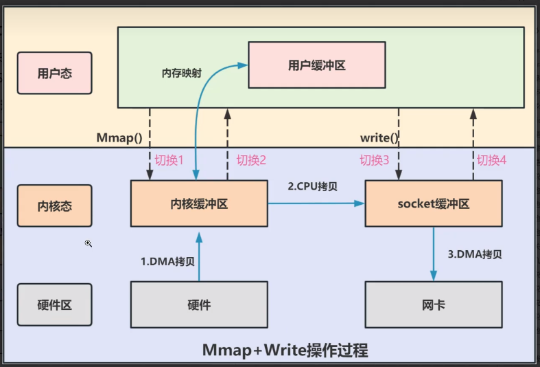
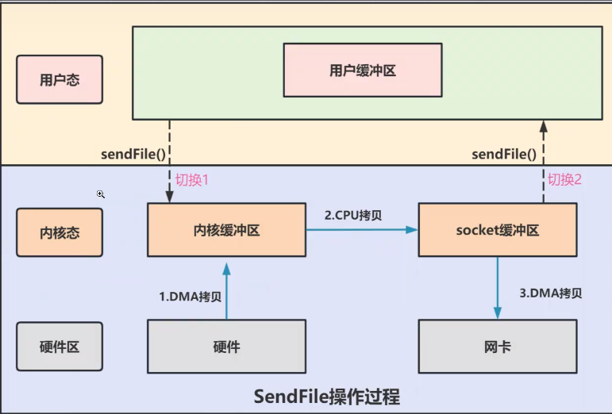

# 零拷贝

~~~
零拷贝(Zero-Copy)是一种操作优化技术，可以快速高效地将数据从文件系统转移到网络接口，而不需要将其从内核空间复制到用户空间。

传统I/O操作流程：
传统I/O的工作方式是，数据读取和写入是从用户空间到内核空间来回复制，从内核空间的数据是通过操作系统层面的I/O接口从磁盘读取或写入。
read(file,tmp_buf,len)
wirte(sockrt,tmp_buf,len)

~~~

## 零拷贝技术
~~~
传统IO的读写流程，包含了4次上下文切换(4次用户态和内核态的切换)，4次数据拷贝(两次CPU拷贝以及两次DMA拷贝)
想要提高文件传输的性能，就需要减少 用户态和内核态的上下文切换 和 内存拷贝 的次数。
零拷贝主要是用来解决操作系统在处理统I/O操作时，频繁复制数据的问题。
零拷贝的主要技术有 MMAP + Write、SendFile等几种方式
~~~

## MMAP + Write
~~~

4次上下文切换 和 3次数据拷贝
~~~

## SendFile
~~~

2次上下文的切换 和 3次数据拷贝
~~~
